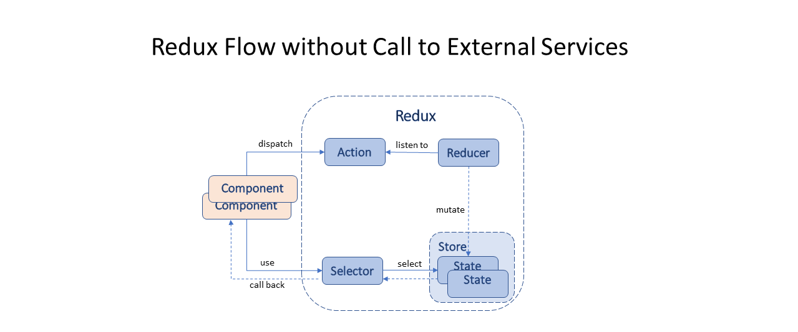

# Mobile Web Banking PoC with Angular 9, Typescript 3.7.5 and NGRX 8.4

This project illustrates the use of Store, states, reducers, effects, actions, selectors, metReducers, NGRX Entity.  

The Redux pattern is very popular in Angular and React web applications. However, this project shows that using the Redux pattern
results in bloated applications.  Despite the Redux proponents' claim that Redux reduces boilerplate from applications, 
The Redux itself consists of boilerplate artifacts: states, actions, reducers, effects and selectors. Actually the applications that
implement the Redux pattern are significant higher in the total file size. Please compare this project with my other project
[Angular-MVC] (https://github.com/dhui808/mobileweb-angular-mvc-poc) that employs Component pattern, MVC pattern and Template Method.
The latter is the architecture I recommend for enterprise applications.

## Architecture

## Build

Run `ng build` to build the project. The build artifacts will be stored in the `dist/` directory.

## Start Development backend mockup server

see 

Run `ng serve` for a dev server.

## Start Development UI server

Run `ng serve` for a dev server.

