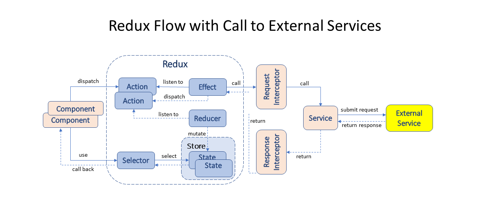

# Mobile Web Banking PoC with Angular and Redux

This project illustrates the impelmentation of Redux pattern in an Angular-based web application, showcasing the use of store, states, 
reducers, effects, actions, selectors, metReducers and NGRX entity.  

The Redux pattern is very popular in Angular and React web applications. However, this project shows that using the Redux pattern
results in a bloated application.  

Despite the Redux proponents' claim that Redux reduces boilerplate from applications,  the Redux itself consists of artifacts tha are
largely boilerplate code: states, actions, reducers, effects and selectors. The Redux-based applications have significant higher total
number of files and project size. 

Please compare this project with my other project [mobileweb-angular-mvc-poc](https://github.com/dhui808/mobileweb-angular-mvc-poc), 
which employs Component pattern, MVC pattern and Template Method pattern. The latter is the time-tested architecture that I strongly
recommend for any mission-critical enterprise applications.

## Architecture

## Build
Run `ng build` to build the project. The build artifacts will be stored in the `dist/` directory.

## Start backend mockup server
see [webservice-mock-server](https://github.com/dhui808/webservice-mock-server)

## Start Development UI server
Run `ng serve` for a dev server.

## Technology Version
Angular 9.0.7
Typescript 3.7.5
Ngrx 8.4

